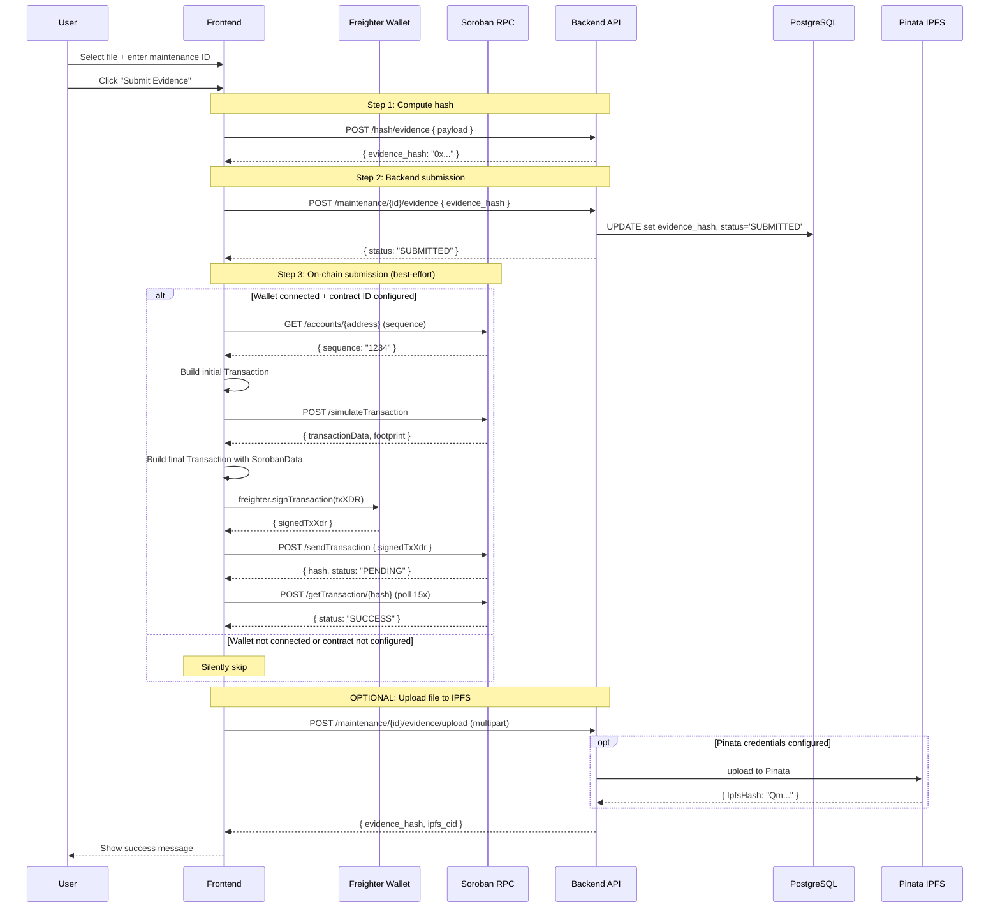
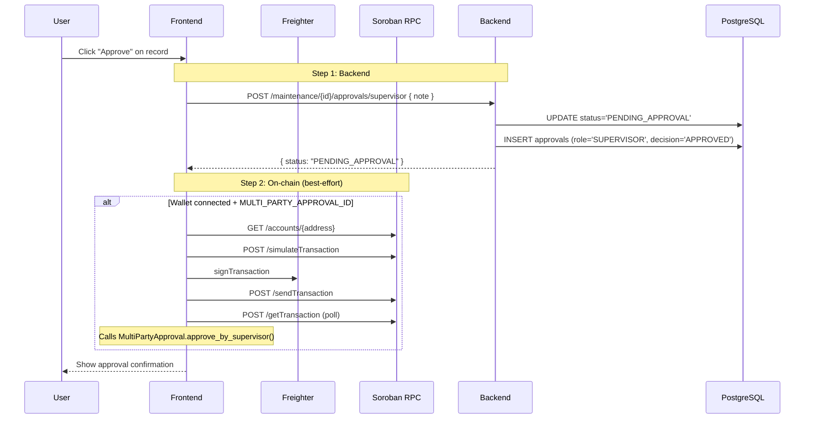
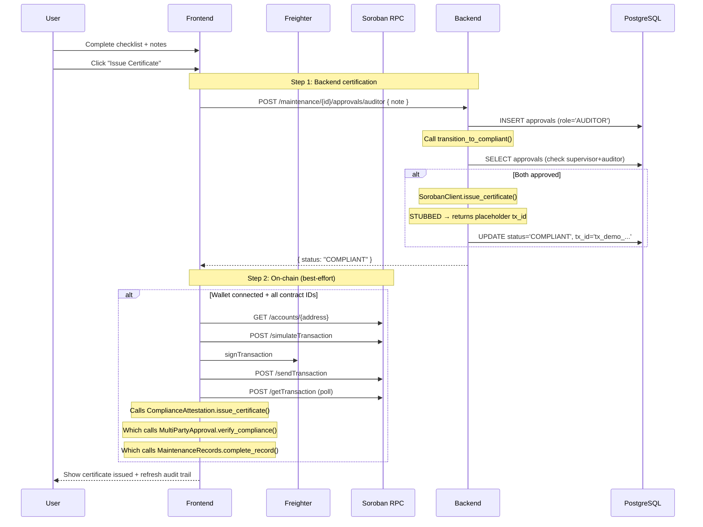

# MaintChain — End-to-End Stellar Transaction Flow Analysis

**Date:** July 23, 2026
**Author:** Architectural Analysis Report
**Scope:** Complete audit of every Stellar transaction flowing through the application

---

## 1. Architecture Overview

### 1.1 Layer Diagram

```
┌─────────────────────────────────────────────────────────────────────┐
│                        FRONTEND (Next.js 14)                        │
│                                                                     │
│  ┌───────────────────────────────────────────────────────────────┐  │
│  │  Wallet Layer (Freighter Extension)                            │  │
│  │  • Detects Freighter via @stellar/freighter-api                │  │
│  │  • Requests access: requestAccess()                            │  │
│  │  • Signs transactions: signTransaction(txXDR, {network, addr}) │  │
│  │  • Reads network: getNetwork()                                 │  │
│  └──────────────────────────┬────────────────────────────────────┘  │
│                              │                                       │
│  ┌──────────────────────────▼────────────────────────────────────┐  │
│  │  Soroban Service Layer (lib/soroban.ts)                       │  │
│  │  • Builds Contract instances from contract IDs                │  │
│  │  • simulates → signs → submits → polls for transaction        │  │
│  │  • Raw HTTP fetch to Soroban RPC (no SDK client wrapper)      │  │
│  └──────────────────────────┬────────────────────────────────────┘  │
│                              │                                       │
│  ┌──────────────────────────▼────────────────────────────────────┐  │
│  │  React Hook Layer (hooks/useSoroban.ts)                       │  │
│  │  • Connects/disconnects Freighter                             │  │
│  │  • Manages wallet state, balance, network validation          │  │
│  │  • Exposes callContract() and sendXlm()                       │  │
│  └──────────────────────────┬────────────────────────────────────┘  │
│                              │                                       │
│  ┌──────────────────────────▼────────────────────────────────────┐  │
│  │  Page Components                                             │  │
│  │  • /upload    → calls submit_evidence on MaintenanceRecords    │  │
│  │  • /approve   → calls approve_by_supervisor on MultiPartyApproval│ │
│  │  • /audit     → calls issue_certificate on ComplianceAttestation│ │
│  └───────────────────────────────────────────────────────────────┘  │
│                                                                     │
│  REST Client (lib/api.ts)  ──►  Backend :8081  ──►  PostgreSQL    │
└─────────────────────────────────────────────────────────────────────┘
                              │
                              ▼
┌─────────────────────────────────────────────────────────────────────┐
│                      STELLAR TESTNET                                │
│  Soroban RPC: https://soroban-testnet.stellar.org                  │
│  Horizon:     https://horizon-testnet.stellar.org                  │
│                                                                     │
│  ┌─────────────────────────────────────────────────────────────┐   │
│  │  Deployed Contracts                                         │   │
│  │                                                             │   │
│  │  1. EquipmentRegistry        (CAT57...WWEW)                 │   │
│  │  2. MaintenanceRecords       (CBRI...775Z)                  │   │
│  │  3. MultiPartyApproval       (CBPH...JOYH)                  │   │
│  │  4. ComplianceAttestation    (CBR4...VIN)                   │   │
│  └─────────────────────────────────────────────────────────────┘   │
└─────────────────────────────────────────────────────────────────────┘
                              │
                              ▼
┌─────────────────────────────────────────────────────────────────────┐
│                      BACKEND (Rust/Axum :8081)                      │
│                                                                     │
│  ┌─────────────────────────────────────────────────────────────┐   │
│  │  SorobanClient (soroban_client.rs)                          │   │
│  │  • verify_compliance()    → STUBBED — returns Ok(true)       │   │
│  │  • issue_certificate()    → STUBBED — returns placeholder tx │  │
│  │  • Reads contract IDs from env vars                          │   │
│  └─────────────────────────────────────────────────────────────┘   │
│                                                                     │
│  ┌─────────────────────────────────────────────────────────────┐   │
│  │  Compliance Engine (complaint.rs)                           │   │
│  │  • is_eligible_for_compliance() — checks DB approvals        │   │
│  │  • transition_to_compliant() — calls SorobanClient           │   │
│  └─────────────────────────────────────────────────────────────┘   │
│                                                                     │
│  ┌─────────────────────────────────────────────────────────────┐   │
│  │  Storage (storage.rs)                                       │   │
│  │  • compute_file_hash() — SHA-256 for evidence               │   │
│  │  • upload_to_ipfs() — Pinata IPFS (optional)                │   │
│  └─────────────────────────────────────────────────────────────┘   │
│                                                                     │
│  ┌─────────────────────────────────────────────────────────────┐   │
│  │  PostgreSQL via sqlx                                        │   │
│  │  Tables: equipment, maintenance_records, approvals, users   │   │
│  └─────────────────────────────────────────────────────────────┘   │
└─────────────────────────────────────────────────────────────────────┘
```

### 1.2 Technology Stack

| Component | Technology | Version |
|-----------|-----------|---------|
| Frontend Framework | Next.js (App Router) | 14.x |
| Stellar SDK (frontend) | @stellar/stellar-sdk | v13 |
| Freighter API | @stellar/freighter-api | v6 |
| Soroban Contracts | Rust (no_std, wasm32v1-none) | SDK v21 |
| Backend | Rust (Axum) | Latest |
| Backend RPC Client | None — raw HTTP fetch (frontend) / stubbed (backend) |
| Database | PostgreSQL 16 | Supabase |
| IPFS | Pinata API | Optional |

### 1.3 Environment Variables Controlling Stellar Integration

```env
# Frontend (.env.local)
NEXT_PUBLIC_SOROBAN_RPC_URL=https://soroban-testnet.stellar.org
NEXT_PUBLIC_EQUIPMENT_REGISTRY_ID=CAT57KYD2WU5QMNBSGB4FJQ37JUUQRKFDMZVPTJZVFC2H44EKWKZWWEW
NEXT_PUBLIC_MAINTENANCE_RECORDS_ID=CBRIGG27YRAXG5H74ZOWSSJGMSTPQHZXJCDXA23QSSBIH6VYZZR4775Z
NEXT_PUBLIC_MULTI_PARTY_APPROVAL_ID=CBPHZFRYKSE6PUWHU2HSNQTWBQ47GYV3U73KXPSOPIX3QLQJ7MLSJOYH
NEXT_PUBLIC_COMPLIANCE_ATTESTATION_ID=CBR4HHPWRDXMJJOG65B6I5TRIBBUFAXAMUCTAJANAPBAIJHPKRUTCVIN

# Backend (Render env)
APPROVAL_CONTRACT_ID=         ← NOT SET in production (backend falls to demo mode)
RECORDS_CONTRACT_ID=          ← NOT SET
ATTESTATION_CONTRACT_ID=      ← NOT SET
```

---

## 2. Contract Analysis

### 2.1 EquipmentRegistry

**Deployed Address:** `CAT57KYD2WU5QMNBSGB4FJQ37JUUQRKFDMZVPTJZVFC2H44EKWKZWWEW`
**WASM Path:** `contracts/equipment-registry/src/lib.rs`

| Method | Args | Returns | Called From | Status |
|--------|------|---------|-------------|--------|
| `register_equipment` | `equipment_id: BytesN<32>, owner: Address, metadata_hash: BytesN<32>` | `BytesN<32>` (eq_hash) | **NOT CALLED** | ✅ Deployed but never invoked |
| `update_owner` | `equipment_id: BytesN<32>, new_owner: Address` | `BytesN<32>` (new hash) | **NOT CALLED** | ✅ Deployed but never invoked |
| `get_equipment` | `equipment_id: BytesN<32>` | `EquipmentSnapshot` | **NOT CALLED** | ✅ Deployed but never invoked |
| `get_equipment_version` | `equipment_id: BytesN<32>, version: u32` | `EquipmentSnapshot` | **NOT CALLED** | ✅ Deployed but never invoked |

**On-chain Storage:**
- `EquipmentSnapshot` per (equipment_id, version) tuple
- Latest version counter per equipment_id
- Self-certifying hash: `SHA256("EQUP" || equipment_id || metadata_hash || created_at || version)`

**Missing:** No frontend or backend code ever calls any method on this contract. Equipment data lives entirely in PostgreSQL.

### 2.2 MaintenanceRecords

**Deployed Address:** `CBRIGG27YRAXG5H74ZOWSSJGMSTPQHZXJCDXA23QSSBIH6VYZZR4775Z`
**WASM Path:** `contracts/maintenance-records/src/lib.rs`

| Method | Args | Returns | Called From | Status |
|--------|------|---------|-------------|--------|
| `create_record` | `maintenance_id: BytesN<32>, equipment_id: BytesN<32>, tech_id: Address` | — | **NOT CALLED** | ✅ Deployed but never invoked |
| `submit_evidence` | `maintenance_id: BytesN<32>, evidence_hash: BytesN<32>` | — | **Frontend (/upload)** | ✅ Attempted via `callContract()` |
| `update_status` | `maintenance_id: BytesN<32>, new_status: MaintenanceStatus` | — | **NOT CALLED** | ✅ Deployed but never invoked |
| `complete_record` | `maintenance_id: BytesN<32>` | — | **NOT CALLED** | ✅ Deployed but never invoked (meant for cross-contract) |
| `get_record` | `maintenance_id: BytesN<32>` | `MaintenanceOrder` | **NOT CALLED** | ✅ Deployed but never invoked |

**On-chain Storage:**
- `MaintenanceOrder` per maintenance_id
  - `equipment_id: BytesN<32>`
  - `tech_id: Address`
  - `status: MaintenanceStatus` (Open → Submitted → PendingApproval → Compliant → Rejected)
  - `evidence_hash: Option<BytesN<32>>`
  - `created_at: u64`

### 2.3 MultiPartyApproval

**Deployed Address:** `CBPHZFRYKSE6PUWHU2HSNQTWBQ47GYV3U73KXPSOPIX3QLQJ7MLSJOYH`
**WASM Path:** `contracts/multi-party-approval/src/lib.rs`

| Method | Args | Returns | Called From | Status |
|--------|------|---------|-------------|--------|
| `set_auditor_required` | `maintenance_id: BytesN<32>, required: bool` | — | **NOT CALLED** | ✅ Deployed but never invoked |
| `approve_by_technician` | `maintenance_id: BytesN<32>` | — | **NOT CALLED** | ✅ Deployed but never invoked |
| `approve_by_supervisor` | `maintenance_id: BytesN<32>, decision: BytesN<32>` | — | **Frontend (/approve)** | ✅ Attempted via `callContract()` |
| `reject_by_supervisor` | `maintenance_id: BytesN<32>` | — | **Frontend (/approve)** | ✅ Attempted via `callContract()` |
| `approve_by_auditor` | `maintenance_id: BytesN<32>` | — | **NOT CALLED** (frontend calls attestation instead) | ✅ Deployed but never invoked |
| `verify_compliance` | `maintenance_id: BytesN<32>` | `bool` | **ComplianceAttestation** (cross-contract) | ✅ Wired via `env.invoke_contract()` |
| `reject_by_supervisor` | `maintenance_id: BytesN<32>` | — | **Frontend** | ✅ Attempted |

**Approval State Machine:**
```
                     ┌──────────┐
                     │   Init   │
                     └────┬─────┘
                          │
              ┌───────────▼───────────┐
              │  tech_approved: bool  │
              │  supervisor_approved  │
              │  auditor_approved     │
              │  auditor_required     │
              └───────────────────────┘
```

### 2.4 ComplianceAttestation

**Deployed Address:** `CBR4HHPWRDXMJJOG65B6I5TRIBBUFAXAMUCTAJANAPBAIJHPKRUTCVIN`
**WASM Path:** `contracts/compliance-attestation/src/lib.rs`

| Method | Args | Returns | Called From | Status |
|--------|------|---------|-------------|--------|
| `issue_certificate` | `approval_contract_id: Address, records_contract_id: Address, maintenance_id: BytesN<32>, cert_hash: BytesN<32>` | `BytesN<32>` (cert_hash) | **Frontend (/audit)** | ✅ Attempted via `callContract()` |
| `get_attestation` | `maintenance_id: BytesN<32>` | `Attestation` | **NOT CALLED** | ✅ Deployed but never invoked |

**Cross-Contract Invocation:**
```
issue_certificate()
    │
    ├──► invoke_contract(approval_contract_id, "verify", [maintenance_id])
    │       └──► MultiPartyApproval.verify_compliance()
    │              └──► checks approval bitmap
    │
    ├──► stores Attestation { issued_at, issuer, cert_hash }
    │
    └──► invoke_contract(records_contract_id, "complete", [maintenance_id])
            └──► MaintenanceRecords.complete_record()
                   └──► status → Compliant
```

**Critical Note:** The cross-contract functions use `symbol_short!()` which limits symbol names to 6-8 characters. The contracts are compiled with specific symbol names:
- `verify` (6 chars) → `MultiPartyApproval.verify_compliance`
- `complete` (8 chars) → `MaintenanceRecords.complete_record`

---

## 3. Transaction Flow Per Feature

### 3.1 Wallet Connection

**Who starts:** User clicks "Connect Wallet"
**File:** `hooks/useSoroban.ts` → `connectWallet()`
**Flow:**

```
User clicks Connect Wallet
    │
    ├──► useSoroban.detectFreighter()
    │       └──► @stellar/freighter-api → isConnected()
    │
    ├──► useSoroban.requestAccess()
    │       └──► @stellar/freighter-api → requestAccess()
    │              └──► Freighter extension popup opens
    │                     └──► User approves → returns address (G...)
    │
    ├──► useSoroban.validateNetwork()
    │       └──► @stellar/freighter-api → getNetwork()
    │              └──► Checks networkPassphrase === Networks.TESTNET
    │
    ├──► useSoroban.refreshBalance(address)
    │       └──► HTTP GET https://horizon-testnet.stellar.org/accounts/{address}
    │              └──► Parses native XLM balance
    │
    └──► State: { address, isConnected: true, balanceXlm }
            └──► Persisted to localStorage: maintchain:freighter:address
```

**Who pays gas:** N/A (no transaction)
**Who signs:** N/A (access request only)
**On-chain change:** None
**PostgreSQL change:** None
**IPFS change:** None

### 3.2 User Registration

**Who starts:** User submits form at /register
**File:** `app/register/page.tsx` → `handleRegister()`
**Flow:**

```
User fills form (name, role, org) + wallet connected
    │
    └──► api.registerUser({ stellar_address, name, role, organization })
            └──► HTTP POST https://maintchain.onrender.com/users
                   │
                   ├──► Backend: INSERT INTO users (id, stellar_address, name, role, organization)
                   │        └──► Returns UserResponse { id, stellar_address, name, role, org, created_at }
                   │
                   └──► Frontend shows success state
```

**Who pays gas:** N/A (no blockchain interaction)
**Who signs:** N/A
**On-chain change:** **None** — user registration is off-chain only
**PostgreSQL change:** New row in `users` table
**IPFS change:** None

**Note:** The backend has no wallet signature verification. Any address can be claimed.

### 3.3 Register Equipment

**Current Implementation:**

```
User POST /equipment
    │
    └──► Backend: INSERT INTO equipment (id, owner_id, ...)
            │
            └──► PostgreSQL: new row in equipment table
```

**Who starts:** API consumer (no UI exists for this)
**On-chain contract call:** **NOT IMPLEMENTED** — the `EquipmentRegistry` contract is never called
**PostgreSQL change:** New row in `equipment` table
**IPFS change:** None

### 3.4 Upload Evidence

**Who starts:** User at /upload page
**File:** `app/upload/page.tsx` → `handleUpload()`
**Flow:**

```
User: selects file, enters maintenance ID, clicks "Submit Evidence"
    │
    ├──► 1. Compute hash
    │       └──► api.computeHash({ payload: `${file.name}-${Date.now()}-${file.size}` })
    │              └──► HTTP POST /hash/evidence
    │                     └──► Backend: SHA-256 hash → returns { evidence_hash }
    │
    ├──► 2. Submit to backend (ALWAYS happens)
    │       └──► api.submitEvidence(maintenanceId, { evidence_hash })
    │              └──► HTTP POST /maintenance/{id}/evidence
    │                     └──► Backend: UPDATE maintenance_records SET evidence_hash, status='SUBMITTED'
    │                                        └──► PostgreSQL updated
    │
    └──► 3. Submit on-chain (ATTEMPTED, silently fails)
            └──► IF wallet connected + MAINTENANCE_RECORDS_ID configured:
                   ├──► callContract(MAINTENANCE_RECORDS_ID, "submit_evidence", [idBytes32, hash])
                   │       └──► soroban.ts: invokeContract()
                   │              ├──► Build Contract(method="submit_evidence")
                   │              ├──► GET account sequence from Soroban RPC
                   │              ├──► Build initial tx → POST /simulateTransaction
                   │              ├──► Parse transactionData (footprint + fees)
                   │              ├──► Build final tx with SorobanData
                   │              ├──► freighter: signTransaction(txXDR)
                   │              ├──► POST /sendTransaction
                   │              ├──► Poll POST /getTransaction (15 retries, 1s apart)
                   │              └──► Return { transactionHash, status }
                   │
                   └──► IF fails → console.warn("Soroban submit_evidence failed:", error)
                           └──► CONTINUES WITH BACKEND-ONLY SUCCESS
```

**Who pays gas:** User (Freighter wallet pays Soroban resource fees from XLM balance)
**Who signs:** User via Freighter (signTransaction popup)
**Which account submits:** User's wallet address
**On-chain change:** MaintenanceRecords → `status: Submitted`, `evidence_hash` set
**PostgreSQL change:** `maintenance_records.evidence_hash` updated, `status` → `SUBMITTED`
**IPFS change:** Optional — if Pinata credentials configured, file uploaded to IPFS

### 3.5 Supervisor Approval

**Who starts:** User at /approve page clicks "Approve" or "Reject"
**File:** `app/approve/page.tsx` → `handleApprove()` / `handleReject()`
**Flow:**

```
User clicks "Approve" on a record
    │
    ├──► 1. Backend approval (ALWAYS happens)
    │       └──► api.supervisorApprove(id, { decision_note })
    │              └──► HTTP POST /maintenance/{id}/approvals/supervisor
    │                     └──► Backend:
    │                            ├── UPDATE maintenance_records SET status='PENDING_APPROVAL'
    │                            └── INSERT INTO approvals (role='SUPERVISOR', decision='APPROVED')
    │                                   └──► PostgreSQL updated
    │
    └──► 2. On-chain approval (ATTEMPTED, silently fails)
            └──► IF wallet connected + MULTI_PARTY_APPROVAL_ID configured:
                   ├──► callContract(MULTI_PARTY_APPROVAL_ID, "approve_by_supervisor", [idBytes32, decisionHex])
                   │       └──► Same invokeContract flow as above
                   │
                   └──► IF fails → console.warn("Soroban approve_by_supervisor failed:", error)
                           └──► CONTINUES WITH BACKEND-ONLY SUCCESS
```

**Who pays gas:** User (Freighter)
**Who signs:** User via Freighter
**On-chain change:** MultiPartyApproval → `supervisor_approved = true` (or false for reject)
**PostgreSQL change:** New row in `approvals` table + maintenance status update
**IPFS change:** None

### 3.6 Auditor Certification

**Who starts:** User at /audit page completes certification dialog and clicks "Issue Certificate"
**File:** `app/audit/page.tsx` → `handleCertify()`
**Flow:**

```
User fills certification form, clicks "Issue Certificate"
    │
    ├──► 1. Backend certification (ALWAYS happens)
    │       └──► api.auditorApprove(maintenanceId, { decision_note })
    │              └──► HTTP POST /maintenance/{id}/approvals/auditor
    │                     └──► Backend:
    │                            ├── INSERT INTO approvals (role='AUDITOR', decision='APPROVED')
    │                            ├── complaint::transition_to_compliant()
    │                            │       ├── is_eligible_for_compliance() checks DB
    │                            │       │       └── supervisor_approved > 0 AND auditor_approved > 0
    │                            │       │
    │                            │       └── SorobanClient.issue_certificate()
    │                            │               └── STUBBED → returns placeholder tx hash
    │                            │                      ("tx_demo_{uuid}" or "tx_soroban_{uuid}")
    │                            │
    │                            └── UPDATE maintenance_records SET status='COMPLIANT', tx_id=$tx_id
    │                                   └──► PostgreSQL updated with demo tx hash
    │
    └──► 2. On-chain certification (ATTEMPTED, silently fails)
            └──► IF wallet connected + all contract IDs configured:
                   ├──► callContract(COMPLIANCE_ATTESTATION_ID, "issue_certificate",
                   │              [MULTI_PARTY_APPROVAL_ID, MAINTENANCE_RECORDS_ID, idBytes32, certHash])
                   │       └──► Same invokeContract flow
                   │
                   └──► IF fails → console.warn("Soroban issue_certificate failed:", error)
                           └──► CONTINUES WITH BACKEND-ONLY SUCCESS
```

**Who pays gas:** User (Freighter) for frontend call + Backend (would need deployer key for backend call)
**Who signs:** User via Freighter (frontend attempt); **Nobody** on backend (stubbed)
**On-chain change:** SHOULD change: Attestation stored + MaintenanceRecords → Compliant
**Real on-chain change:** **NONE** — the SorobanClient.issue_certificate() is **completely stubbed**
**PostgreSQL change:** New approvals row + maintenance_records status → COMPLIANT + demo tx_id
**IPFS change:** None

---

## 4. Data Flow

### 4.1 Storage Classification

| Data | Blockchain | PostgreSQL | IPFS | Frontend State | Notes |
|------|-----------|------------|------|----------------|-------|
| Equipment metadata (name, serial, location) | ❌ Never written | ✅ `equipment` table | ❌ | ❌ Refreshed from API | Should be on EquipmentRegistry but isn't |
| Equipment ownership chain | ❌ Never written | ✅ `equipment.owner_id` | ❌ | ❌ | Versioned snapshots exist on contract but unused |
| Maintenance order status | ⚠️ Attempted | ✅ `maintenance_records.status` | ❌ | ✅ Local state | On-chain calls silently fail |
| Evidence hash | ⚠️ Attempted | ✅ `maintenance_records.evidence_hash` | ❌ | ❌ | On-chain calls silently fail |
| Evidence files | ❌ | ❌ | ✅ Optional (Pinata) | ❌ | SHA-256 hash stored; file upload optional |
| Supervisor approval | ⚠️ Attempted | ✅ `approvals` table | ❌ | ❌ | On-chain calls silently fail |
| Auditor certification | ⚠️ Attempted | ✅ `approvals` + `tx_id` | ❌ | ❌ | Backend SorobanClient is STUBBED |
| Compliance certificates | ⚠️ Attempted | ❌ | ❌ | ❌ | On-chain attestation never actually issued |
| Worker profiles | ❌ | ❌ | ❌ | ✅ `maintchain.ts` | Hardcoded seed data |
| Machine metadata | ❌ | ❌ | ❌ | ✅ `maintchain.ts` | Hardcoded seed data |
| User registration | ❌ | ✅ `users` table | ❌ | ❌ | No wallet signature verification |
| Transaction hashes | ✅ (would be returned) | ✅ `approvals.on_chain_tx_id` | ❌ | ⚠️ Displayed | Currently shows demo/placeholder hashes |

### 4.2 Key Finding: All On-Chain Operations Are "Best-Effort"

For every on-chain operation, the pattern is:

```
try {
    await sorobanContractCall();  // may throw
} catch (error) {
    console.warn("Soroban call failed:", error);
    // CONTINUE AS IF SUCCEEDED
}
```

The Soroban calls are bonus/supplementary. The application functions fully without them.

---

## 5. Transaction Sequence Diagrams

### 5.1 Upload Evidence



### 5.2 Supervisor Approval



### 5.3 Auditor Certification



---

## 6. Security Review

### 6.1 Wallet Ownership

| Issue | Severity | Description |
|-------|----------|-------------|
| No wallet signature on user registration | **HIGH** | The `POST /users` endpoint accepts any `stellar_address` without verifying the caller owns that address. User A can register User B's wallet address. |
| Backend uses placeholder tx hashes | **MEDIUM** | The `SorobanClient.issue_certificate()` generates `tx_demo_{uuid}` or `tx_soroban_{uuid}` that are not real on-chain transactions. These are stored in the database as if they were real. |
| No deployer key configured | **MEDIUM** | Backend env vars `APPROVAL_CONTRACT_ID`, `RECORDS_CONTRACT_ID`, `ATTESTATION_CONTRACT_ID` are not set in production. The backend operates entirely in demo mode. |

### 6.2 Unauthorized Contract Invocation

| Issue | Severity | Description |
|-------|----------|-------------|
| Soroban contracts have no authorization checks | **HIGH** | None of the 4 contracts check `env.invoker()` or require specific Address authorization. Any wallet can call any method on any contract. |
| No role verification on-chain | **MEDIUM** | `approve_by_supervisor` can be called by anyone, not just a designated supervisor address. |
| `complete_record` has `assert_eq!` but no authorization | **MEDIUM** | The contract checks state but doesn't verify the caller is the ComplianceAttestation contract. |

### 6.3 Backend Trust Assumptions

| Issue | Severity | Description |
|-------|----------|-------------|
| Auth middleware exists but is NOT wired | **HIGH** | The `auth` function and `API_KEY_ENV` check in `main.rs` are defined with `#[allow(dead_code)]` and never applied to any route. **Every endpoint is fully open.** |
| CORS allows all origins | **LOW** | `CorsLayer::permissive()` allows any origin. Acceptable for demo but dangerous for production. |
| No rate limiting | **LOW** | No protection against abuse. Acceptable for testnet. |

### 6.4 Replay Attacks

| Issue | Severity | Description |
|-------|----------|-------------|
| Transactions include `setTimeout(30)` | **LOW** | Soroban transactions have a 30-second timeout. No replay protection beyond network sequence numbers. Standard. |

### 6.5 Contract Authorization

| Issue | Severity | Description |
|-------|----------|-------------|
| Cross-contract calls use hardcoded symbol names | **LOW** | `symbol_short!("verify")` and `symbol_short!("complete")` work correctly as long as the target contracts export those exact symbols. Verified: they do. |

---

## 7. Missing Components

### 7.1 Never-Used Contract Methods

| Contract | Method | Impact |
|----------|--------|--------|
| `EquipmentRegistry` | ALL 4 methods | Equipment exists only in PostgreSQL. No on-chain equipment registry is used. |
| `MultiPartyApproval` | `approve_by_technician` | Technician approval is never recorded on-chain. |
| `MultiPartyApproval` | `approve_by_auditor` | Auditor approval is never recorded on-chain (attestation contract calls `verify_compliance` directly). |
| `ComplianceAttestation` | `get_attestation` | Certificates cannot be verified on-chain after issuance. |

### 7.2 Stubbed/Silently-Failing Operations

| Operation | What Should Happen | What Actually Happens |
|-----------|-------------------|----------------------|
| Backend `verify_compliance()` | Call `MultiPartyApproval.verify_compliance` on-chain | Returns `Ok(true)` without any RPC call |
| Backend `issue_certificate()` | Build tx, sign with deployer key, submit to RPC | Returns `"tx_demo_{uuid}"` or `"tx_soroban_{uuid}"` placeholder |
| Frontend Soroban calls | User sees error if on-chain call fails | `console.warn()` — user never knows it failed |
| Frontend Equipment registration | Call `EquipmentRegistry.register_equipment` | **No UI exists** |
| Frontend Maintenance creation | Call `MaintenanceRecords.create_record` | **No UI call exists** |

### 7.3 Missing Infrastructure

| Component | Status | Criticality |
|-----------|--------|-------------|
| Backend deployer key | ❌ Not configured | **Critical** — no backend-initiated on-chain operations possible |
| Full Soroban RPC signing flow (backend) | ❌ Not implemented | **Critical** — issue_certificate always returns placeholder |
| SorobanClient error handling | ❌ Returns Ok(true) for everything | **High** — compliance checks are bypassed |
| Equipment registration from frontend | ❌ No UI or API flow | **Medium** — EquipmentRegistry contract is unused |
| Maintenance record creation on-chain | ❌ Never called | **Medium** |
| Technician approval on-chain | ❌ Never called | **Low** — MultiPartyApproval has the method but no one calls it |
| On-chain certificate verification | ❌ get_attestation never called | **Low** |
| Event indexing service | ❌ Not implemented | **Future** |
| Transaction monitoring/retry | ❌ Basic 15-second poll | **Low** |

---

## 8. Recommended Production Architecture

### 8.1 High Priority — Must Fix

1. **Wire the backend deployer key**
   - Set `DEPLOYER_SECRET_KEY` in the backend environment
   - Implement full Soroban transaction signing in `soroban_client.rs`:
     - Build transaction → simulate → sign with deployer key → submit → poll
   - Set `APPROVAL_CONTRACT_ID`, `RECORDS_CONTRACT_ID`, `ATTESTATION_CONTRACT_ID`

2. **Fix the SorobanClient stubs**
   - `verify_compliance()`
     - Actually call `MultiPartyApproval.verify_compliance` via RPC
     - Parse the boolean return value from simulation
   - `issue_certificate()`
     - Actually build and submit a real transaction to `ComplianceAttestation.issue_certificate`
     - Return the real transaction hash

3. **Add on-chain error visibility to users**
   - Replace `console.warn()` with actual UI error states
   - Show a toast/banner when on-chain call fails but backend succeeded
   - Allow retry of failed on-chain operations

4. **Implement frontend equipment registration**
   - Create a simple UI or API trigger to call `EquipmentRegistry.register_equipment`
   - Store the returned `equipment_hash` alongside the database record

### 8.2 Medium Priority

5. **Dual-write pattern — fail the action if on-chain fails**
   - Current: "submit to backend, try on-chain, ignore failure"
   - Recommended: "try on-chain first, if succeeds → submit to backend, else → rollback"

6. **Add authorization to Soroban contracts**
   - `approve_by_supervisor` should check `env.invoker() === designated_supervisor`
   - `complete_record` should check `env.caller() === compliance_attestation_contract`
   - Store authorized addresses per maintenance record

7. **Backend auth middleware**
   - Wire the existing `auth` function into the Axum router
   - Require `Authorization: Bearer <API_KEY>` for write endpoints
   - Generate a secure API key during deployment

8. **User registration with wallet proof**
   - Require users to sign a challenge message with Freighter to prove wallet ownership
   - Verify the signature on the backend before storing the user record

### 8.3 Future Enhancements

9. **Event indexing service**
   - Listen for Soroban contract events (when SDK supports them)
   - Index on-chain events into PostgreSQL for fast querying
   - Sync backend state with on-chain state periodically

10. **Contract upgrade path**
    - Add `#[contracttype]` metadata for versioning
    - Plan for proxy/upgrade pattern if needed

11. **Gas optimization**
    - Batch approvals where possible
    - Use smaller data types (u32 vs u64 where appropriate)
    - Reduce cross-contract call overhead

12. **Retry logic with exponential backoff**
    - Replace the simple 15-second poll with a proper retry strategy
    - Queue failed transactions for later retry
    - Notify users of pending transactions

---

## 9. Summary of Current State

| Feature | Backend (PostgreSQL) | On-Chain (Soroban) | Status |
|---------|---------------------|-------------------|--------|
| User Registration | ✅ Implemented | ❌ Not needed | ✅ Complete |
| Equipment Registration | ✅ Implemented | ❌ Contract exists but never called | ⚠️ Gap |
| Maintenance Order | ✅ Implemented | ❌ create_record never called | ⚠️ Gap |
| Evidence Upload | ✅ Implemented | ⚠️ Attempted, silently fails | ⚠️ Partial |
| Supervisor Approval | ✅ Implemented | ⚠️ Attempted, silently fails | ⚠️ Partial |
| Auditor Certification | ✅ Implemented | ⚠️ Backend stubbed, frontend fails | ⚠️ Partial |
| Cross-contract wiring | N/A | ✅ Wired in compliance-attestation | ✅ Complete |
| Wallet Connection | N/A | ✅ User signs via Freighter | ✅ Complete |
| XLM Balance | N/A | ✅ Horizon REST API | ✅ Complete |
| XLM Transfer | N/A | ✅ sendXlm via Freighter | ✅ Complete |

**Conclusion:** MaintChain has a sophisticated architecture with all the right pieces — 4 deployed Soroban contracts, a complete frontend invocation pipeline, and cross-contract wiring. However, the on-chain operations are **best-effort and silently failing** for all user-facing features. The system currently works as a **PostgreSQL-backed demo** with cosmetic Soroban integration. For production readiness, the critical path is: (1) configure the backend deployer key, (2) implement real RPC calls in `SorobanClient`, and (3) surface on-chain failures to users.
